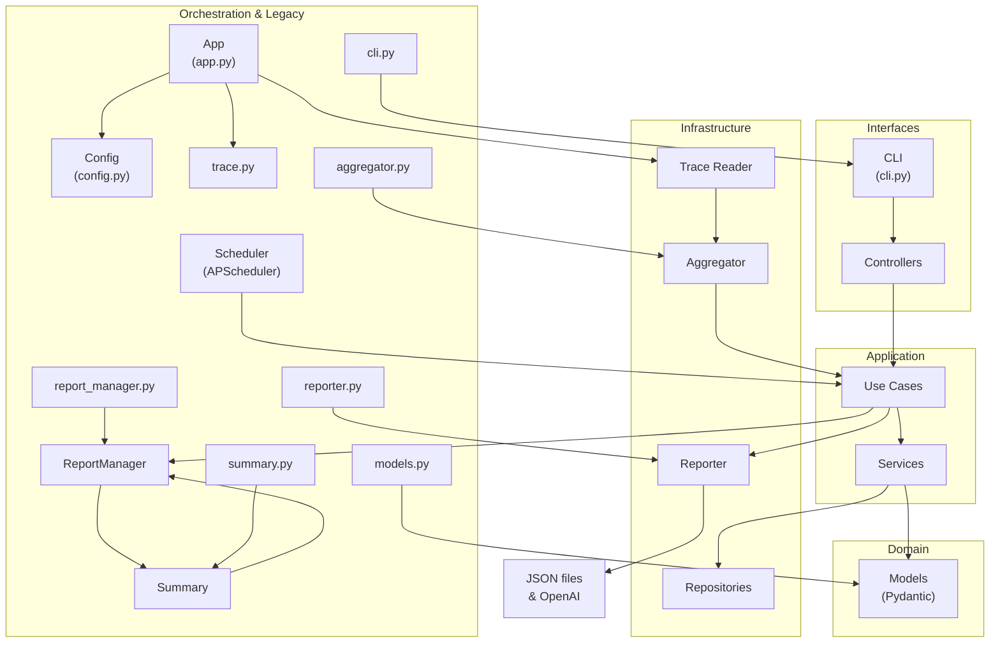

# Clean Architecture

Linux EDR has been refactored to follow Clean Architecture principles, organizing the codebase into distinct layers with clear responsibilities and dependencies.

## Architectural Layers

The system is organized into four primary layers, following the dependency rule where inner layers are independent of outer layers:



### Domain Layer

The innermost layer containing the core business logic and entities:

- **Models**: Core data structures and business rules without dependencies on external systems
- **Value Objects**: Immutable objects that model concepts in our domain
- **Exceptions**: Domain-specific exceptions

### Application Layer

Contains the application-specific business rules and orchestrates the domain objects:

- **Services**: Stateless operations that implement business rules
- **Use Cases**: Implementation of specific business processes
- **Interfaces**: Defines contracts that outer layers must implement

### Infrastructure Layer

Provides concrete implementations for external systems and tools:

- **Repositories**: Data access implementations
- **External Services**: Implementation of third-party service integrations
- **Persistence**: Storage mechanisms

### Interfaces Layer

Contains adapters that convert data between formats suitable for external agencies and internal use:

- **Controllers**: Handle incoming requests from CLI, API, or other interfaces
- **Presenters**: Format data for output

## Key Benefits

1. **Testability**: Each layer can be tested in isolation
2. **Maintainability**: Changes in one layer have minimal impact on others
3. **Flexibility**: External dependencies can be replaced without affecting core business logic
4. **Clear Separation of Concerns**: Each component has a single responsibility

## Project Structure

```text
linux_edr/
├── domain/              # Core business logic
│   ├── models/          # Domain entities and value objects
│   └── exceptions/      # Domain-specific exceptions
├── application/         # Application-specific business rules
│   ├── services/        # Stateless operations
│   ├── use_cases/       # Business processes
│   └── interfaces/      # Contracts for infrastructure
├── infrastructure/      # External systems implementations
│   ├── repositories/    # Data access implementations
│   └── services/        # External service integrations
└── interfaces/          # Entry points to the system
    └── controllers/     # Input adapters (CLI, API controllers)
```

## Migration Path

The codebase is currently in transition from the previous architecture to Clean Architecture. Some components still follow the old structure but are gradually being migrated to the new layered approach.

Legacy components like `trace.py`, `aggregator.py`, `report_manager.py`, `reporter.py`, and `models.py` are maintained for backward compatibility while their functionality is gradually moved to the appropriate layer in the new architecture. 